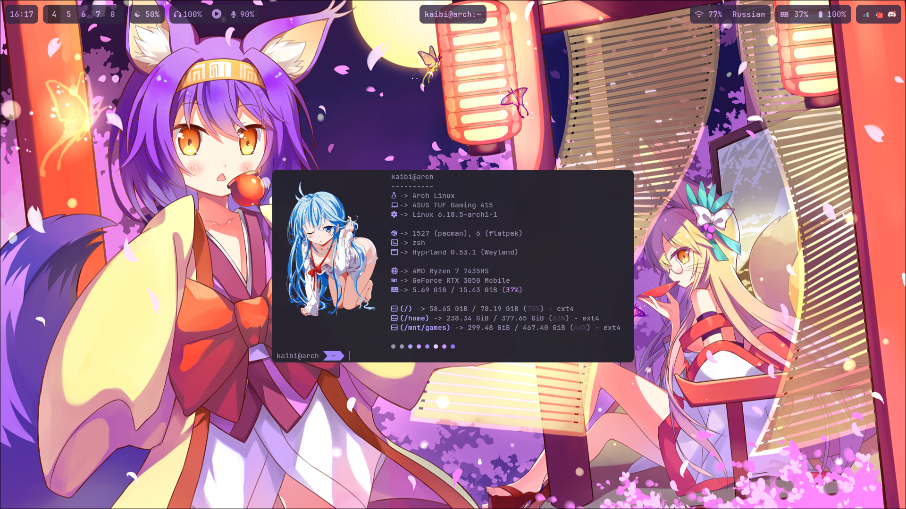

<h1 align=center>Dotfiles</h1>

<p align=center>WIP personal dotfiles</p>

<h2 align=center>Showcase</h2>

<p align=center>
  
</p>

<h2 align="center">Installation</h2>

I will not ensure that this script works properly, or even at all.  
So use it at your own risk. 

yay is required!

```bash
#Installing yay

git clone https://aur.archlinux.org/yay.git ~/yay
cd ~/yay
makepkg -si
```

```bash
#Installing dots

git clone https://github.com/Lahanig/dotfiles ~/dotfiles
cd ~/dotfiles
./install.sh
```
